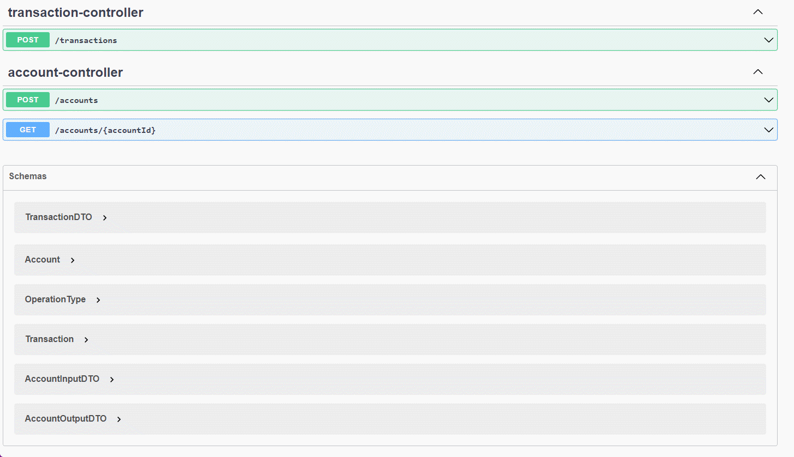

# 💥 Pismo Back Teste 3.0

This is a showcase project developed in Java with the Spring framework to fulfill the requirements
of the Pismo Back Teste 3.0.

## ✨ Technologies

- [Spring Framework](https://spring.io/)
- [PostgreSQL](https://www.postgresql.org/)
- [Flyway](https://flywaydb.org/)
- [ModelMapper](http://modelmapper.org/)
- [Lombok](https://projectlombok.org/)
- [OpenAPI](https://www.openapis.org/)
- [Testcontainers](https://www.testcontainers.org/)

## ⚡️ Minimum requirements

- [Java 11+](https://adoptium.net/?variant=openjdk11&jvmVariant=hotspot)
- [Docker >= 20.10.9](https://docs.docker.com/get-docker/)
- [Docker Compose V1 >= 1.29](https://docs.docker.com/compose/install/)

## 🚀 Usage

The preferred way to run the project is through Docker running the following command:

```sh
docker-compose up
```

Once the project starts running go to project's [Swagger UI](http://localhost:8080/swagger-ui)
to have access to all the endpoints and schemas as seen bellow:



Optionally you can download the API specification from [here](http://localhost:8080/api-docs.yaml)
and load it on your preferred tool, like [Postman](https://www.postman.com/).

### 🐋 Building the Docker image

If changes were made to the project or if you prefer to build the Docker image locally, then run:

```sh
./mvnw spring-boot:build-image
```

This will generate an image with the name and tag ghcr.io/brunoqkz/pismo:latest.

### 💻 Running the project outside Docker

During development is recommended to run the project outside of Docker to have the benefits provided
by [Spring Boot Developer Tools](https://docs.spring.io/spring-boot/docs/current/reference/html/using.html#using.devtools)
like hot reload. To do so, start the database:

```sh
docker-compose up -d db
```

And then run the project with Maven:

```sh
./mvnw spring-boot:run
```

If you have a database already running (the project is compatible with PostgreSQL up to version 13),
then set the appropriate environment variables for the datasource like described
[here](https://docs.spring.io/spring-boot/docs/current/reference/html/features.html#features.external-config).

Also, the project can run directly from the IDE.